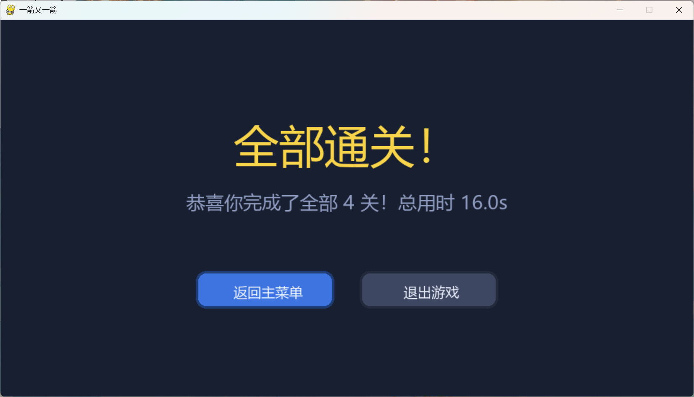
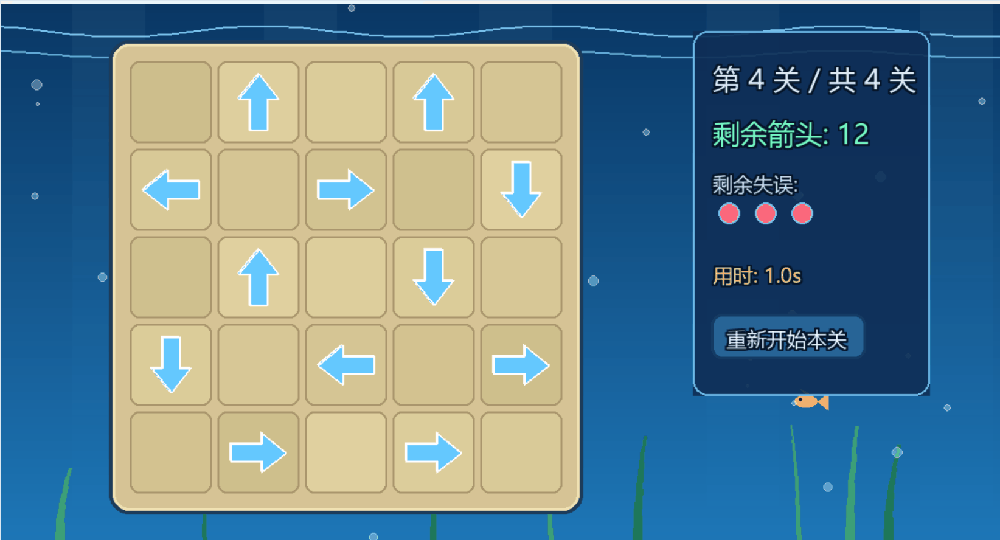
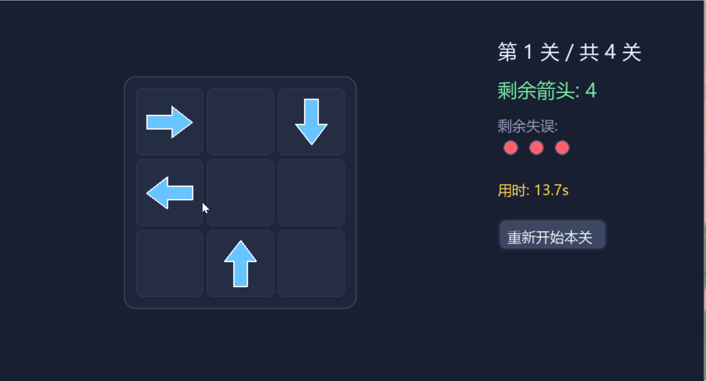
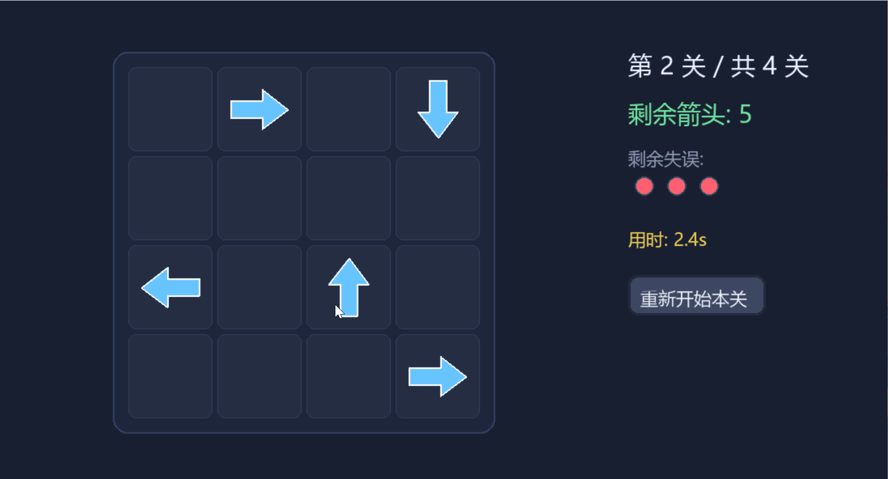
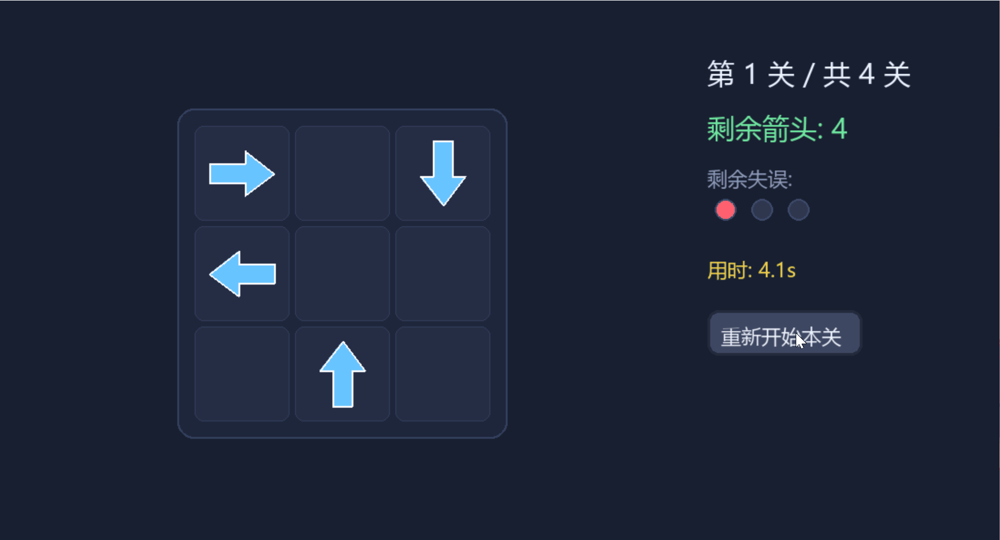

# 一箭又一箭 · 海洋版（Arrow Game）

**作者**：张楠  
**学号**：102401204

---

## 项目简介

本项目是软件工程课程的第二次个人作业。使用 Python 和 Pygame 开发的一款点击式箭头解谜小游戏，以海洋为主题风格。

玩家需要观察棋盘中箭头的方向和相互阻挡关系，按照正确的顺序点击箭头，使其飞出棋盘。清空全部箭头即可通关。游戏包含 4 个关卡，其中第四关为 12 箭头的高难度布局。

---

## 开发环境

- 操作系统：Windows 11
- 编程语言：Python 3.12.10
- 图形库：Pygame 2.6.1
- 开发工具：记事本   Code
- AIGC 工具：DeepSeek（用于代码生成、Bug 排查、界面优化和玩法设计）

---

## 主要功能

1. 上下左右四种方向的箭头，点击后沿箭头方向飞出
2. 路径阻挡检测：前方有箭头时无法飞出，给出抖动变红的碰撞反馈
3. 失误次数机制：每关 3 次失误机会，用完则失败
4. 关卡计时：实时显示本关用时
5. 重新开始确认框：避免误操作
6. 4 个可通关关卡，第四关 12 箭头高难度布局
7. 海洋主题背景：动态波浪、气泡上浮、海草摇摆、小鱼游动
8. 通关时绽放彩色烟花，庆祝全部通关
9. 细腻的动画：箭头飞出淡出、碰撞抖动、颜色渐变

---

## 安装与运行方法

1. 安装 Python 3.12 或更高版本。安装时请务必勾选 **Add Python to PATH**。

2. 打开命令行（cmd 或 PowerShell），输入以下命令安装 Pygame：

```bash
pip install pygame
```

3. 进入项目文件夹，运行游戏：

```bash
python main.py
```

---

## 游戏操作说明

- **鼠标点击箭头**：若箭头前进方向无阻挡，箭头飞出棋盘并消失；若前方有阻挡，箭头抖动变红，失误次数减 1。
- **重新开始本关**：点击右侧“重新开始本关”按钮，会弹出确认框，确认后重置本关，失误恢复为 3 次。
- **失误次数**：每关有 3 次失误机会，用完则本关失败，可点击“重试本关”重新开始。
- **通关流程**：清空棋盘所有箭头后，显示“关卡完成”并进入下一关；第 4 关通关后先显示“关卡完成”，再点击“查看最终结果”进入最终结算画面。
- **键盘快捷键**：按 **R** 键弹出重新开始确认框，按 **Esc** 返回主菜单。

---

## 游戏截图与演示

### 静态截图



### 动态演示










---

## 关卡说明

| 关卡 | 棋盘尺寸 | 箭头数量 | 说明 |
|------|----------|----------|------|
| 第 1 关 | 3 × 3 | 4 | 入门教学关 |
| 第 2 关 | 4 × 4 | 5 | 增加阻挡关系 |
| 第 3 关 | 5 × 5 | 7 | 需要考虑更多顺序 |
| 第 4 关 | 5 × 5 | 12 | 高难度挑战关 |

---

## AIGC 使用说明

本项目在开发过程中使用 DeepSeek 作为 AIGC 辅助工具，包括：

- 生成 Pygame 基础框架代码
- 排查和修复方向映射 Bug
- 修复 Pygame 2.6.1 字体崩溃问题
- 实现计时、重新开始确认框、烟花效果等功能
- 优化海洋主题背景的绘制

具体使用过程记录详见博客。

---

## 项目文件结构

```text
Arrow Game/
├── main.py             主程序（最终版）
├── demo1.py            迭代版本1：初始版（方向映射有误）
├── demo2.py            迭代版本2：修复箭头方向
├── demo3.py            迭代版本3：增加计时和确认框
├── demo4.py            迭代版本4：增加第四关难度
├── README.md           项目说明
└── screenshots/        游戏截图与演示
    ├── 成功.gif
    ├── 全部通关.png
    ├── 失误.gif
    ├── 完成一关.gif
    ├── 重新开始.gif
    └── 最终版本测试.gif
```

---

## 版本迭代记录

- demo1.py：初始版本，实现基本游戏逻辑（方向映射有误）
- demo2.py：修复箭头方向与飞出方向不一致的问题
- demo3.py：增加关卡计时与重新开始确认框
- demo4.py：增加第四关难度
- main.py：最终版，海洋主题、烟花效果、字体优化

---
